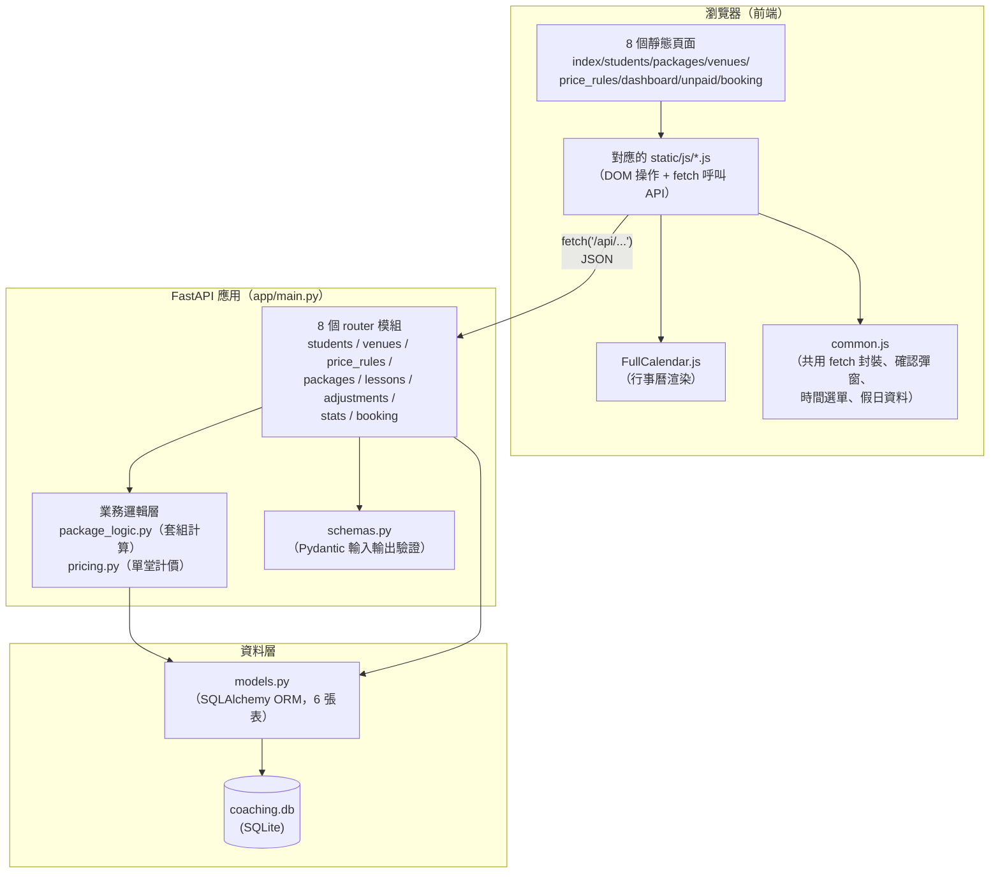
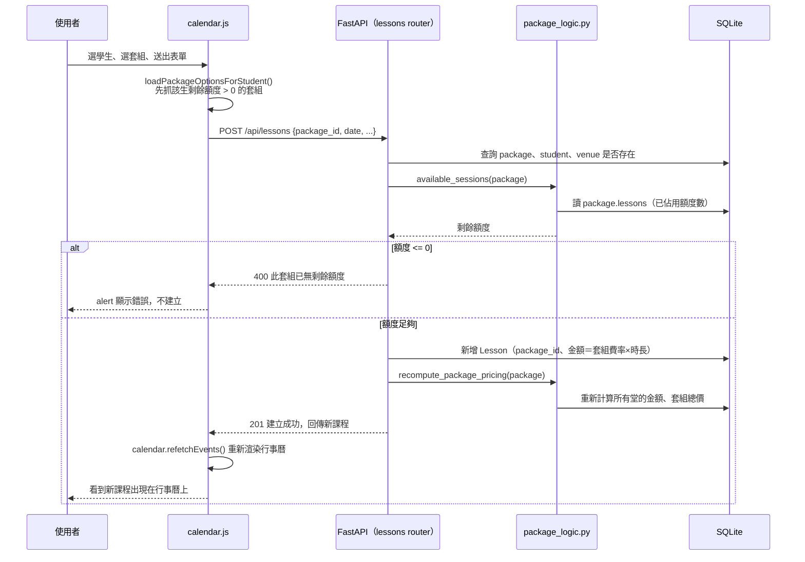
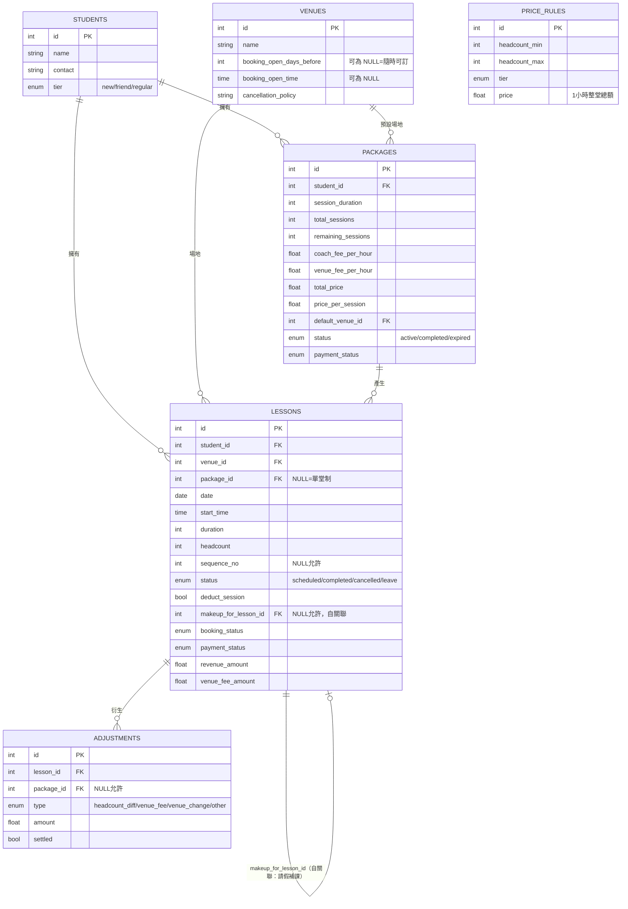

# 系統架構文件

本文件依「目前實際的程式碼」整理，不是依規格文件回推。與規格有出入的
地方，另外整理在〈實作與規格的落差〉一節。

---

## 1. 技術棧

| 層 | 技術 | 版本／說明 |
|---|---|---|
| 後端框架 | FastAPI | `0.141.1` |
| ORM | SQLAlchemy 2.0（`Mapped`/`mapped_column` 宣告式風格） | `2.0.52` |
| 資料庫 | SQLite（單一檔案 `coaching.db`） | — |
| 資料驗證/序列化 | Pydantic v2（`ConfigDict(from_attributes=True)`） | `2.13.5` |
| ASGI server | Uvicorn | `0.52.4` |
| 前端 | 原生 HTML / CSS / JavaScript（無框架、無建置流程） | — |
| 行事曆元件 | FullCalendar.js（CDN 載入） | `6.1.15` |
| 靜態檔案服務 | FastAPI `StaticFiles`（直接掛載 `static/` 目錄） | — |

後端沒有 `requirements.txt` 以外的建置步驟；前端沒有 bundler／npm，瀏覽器
直接載入 `static/js/*.js`，靠 `<script>` 標籤順序管理相依關係。

---

## 2. 分層架構

**分層原則**：路由層（`routers/*.py`）只負責「收請求、找資料、呼叫邏輯、
回傳」，實際的計算規則（套組剩餘堂數、金額分攤、請假順延）都集中在
`package_logic.py`／`pricing.py`，不散落在各個路由函式裡。前端沒有任何
框架狀態管理，每個頁面的 JS 檔案自己管理該頁面需要的變數，靠重新呼叫
`loadXxx()` 函式重新抓資料、重繪 DOM。

---

## 3. 一次完整的資料流：新增一堂「掛在套組上」的課程

以「臨時約時間」套組為例，這是目前系統裡邏輯最完整的一條路徑，能看出
前後端怎麼串起來：

---

## 4. 資料模型（依 `app/models.py` 實際欄位）

**兩個關鍵的「即時計算、不吃舊值」欄位**：`Package.remaining_sessions`
與 `Package.status` 雖然是實際存在的資料表欄位，但 API 回傳給前端的值
一律由 `package_logic.py` 的 `remaining_sessions()` / `live_status()`
即時算過，不直接信任欄位裡存的舊值（詳見 `DEVLOG.md` 的剩餘堂數 bug
修正）。`available_sessions` 則完全是計算欄位，資料庫裡沒有對應的實體
欄位。

---

## 5. 模組職責一覽

### 後端（`app/`）

| 檔案 | 職責 |
|---|---|
| `main.py` | FastAPI 進入點：建表、掛路由、掛靜態檔案 |
| `database.py` | SQLite 連線、session 工廠設定 |
| `models.py` | 六張表的 ORM 定義與關聯 |
| `schemas.py` | 所有 API 的請求/回應格式（Pydantic） |
| `pricing.py` | 單堂制查價目表計價（含 3 人以上朋友價退回熟客價的例外） |
| `package_logic.py` | 套組相關的所有計算邏輯：批次產生課程、剩餘堂數／狀態即時計算、金額分攤重算、請假順延、人數差額試算 |
| `seed.py` | 啟動時寫入預設價目表資料（若不存在） |
| `routers/students.py` | 學生 CRUD |
| `routers/venues.py` | 場地 CRUD（含隨時可訂的 NULL 開放規則） |
| `routers/price_rules.py` | 價目表 CRUD、`/resolve` 試算端點 |
| `routers/packages.py` | 套組 CRUD、批次排課、付款狀態級聯、結算單 |
| `routers/lessons.py` | 單堂課程 CRUD、掛套組的額度檢查、請假順延觸發點 |
| `routers/adjustments.py` | 額外費用 CRUD、結清狀態切換 |
| `routers/stats.py` | 收入統計（週/月/年/依學生/依月份）、未收款清單彙整 |
| `routers/booking.py` | 訂場檢查三分區邏輯、標記已訂 |

### 前端（`static/js/`）

| 檔案 | 職責 |
|---|---|
| `common.js` | 共用 fetch 封裝、共用確認彈窗（`confirmDialog`）、時間/時長下拉選單產生器、導覽列 active 狀態、數字輸入框防滾輪誤觸 |
| `holidays.js` | 台灣國定假日資料表（純資料，逐年手動維護） |
| `calendar.js` | 行事曆頁：FullCalendar 初始化、課程新增/編輯 modal、套組掛載邏輯、額外費用區塊 |
| `packages.js` | 套組頁：清單、新增（月曆選日期／臨時約時間兩種模式）、LINE 課程訊息產生器、結算單 |
| `students.js` / `venues.js` / `price_rules.js` | 各自的 CRUD 頁面邏輯 |
| `dashboard.js` | 收入統計圖表渲染 |
| `unpaid.js` | 未收款清單三分區渲染、額外費用原地編輯 |
| `booking.js` | 訂場檢查頁渲染 |

---

## 6. 實作與規格的落差

依 `spec/core.md` 逐條核對目前程式碼，發現以下差異，分三類：

### A. 刻意的設計反轉（使用者主動要求，非 bug）

| 規格怎麼寫 | 實際怎麼做 | 差異原因 |
|---|---|---|
| 套組攤提單價「購買時算好 `price_per_session` 存死」 | 改成即時計算：`coach_fee_per_hour`/`venue_fee_per_hour` 兩個每小時費率，每堂金額＝費率×該堂實際時長，套組費率或時長改變會重算全部堂 | 使用者主動要求把計價模式反過來（見 `DEVLOG.md`） |
| 套組「固定 8 堂」 | `total_sessions` 完全可自訂，建立後也能編輯 | 真實使用發現堂數常有例外（缺席一堂、多算一堂） |
| 建包時「填起始日期＋重複週幾，系統自動產生」 | 三種排課模式並存：①手動月曆點選日期 ②快速帶入批次產生 ③「臨時約時間」——建立時不產生任何課程，之後在行事曆逐堂新增再掛回套組 | 真實情境有連假需要跳過、也有學生是先收費、時間之後才臨時約定 |

### B. 規格寫了、但從未真正做出來

| 規格內容 | 現況 |
|---|---|
| 「扣堂數」欄位在編輯課程並將狀態改為請假／取消時應該出現，讓使用者手動決定要不要扣 | 這個 UI 欄位沒有被實作，取消/請假的扣堂邏輯是寫死在後端的（請假一律不扣、另外產生補課；取消目前沒有特殊處理） |
| 套組狀態有 `expired`（已過期） | 系統從未在任何地方把套組設成這個狀態，是個沒有使用到的欄位 |
| 結算單「累積到包上完（`remaining_sessions=0`）才彙整成結算單」 | 實際上結算端點沒有這個門檻，任何時候只要有未結清的額外費用都可以結算，不需要等套組全部上完 |

### C. 實際做出來、但規格完全沒提到的功能

這些是開發過程中因為真實使用回饋新增的，`spec/core.md` 完全沒有涵蓋：

- 行事曆與月曆選日期都會標示台灣國定假日
- 套組列表的 LINE 課程訊息一鍵產生器
- 額外費用新增「臨時改場地」類型
- 全站刪除確認改成客製化置中彈窗
- 收入統計排除已取消課程（規格對「取消」跟收入統計的交互完全沒提到）
- 課程套組列表的未收款／未結清差額顯眼顏色標示
- 學生列表依「是否有進行中套組」排序
- 數字輸入框防止滑鼠滾輪誤改金額

---

## 7. 規格摘要（一頁版，適合放進簡報）

**核心資料模型**：六張表——`students`（學生）、`venues`（場地）、
`price_rules`（單堂價目表）、`packages`（多堂套組合約）、`lessons`
（唯一的課程事實來源，單堂與套組課都在這裡）、`adjustments`（額外費用/
差額）。`lessons.package_id` 是否為 NULL 區分單堂制與套組制。

**最關鍵的業務規則（5 條）**：

1. **套組計價**：教練費／場地費各自設每小時費率，每堂金額＝費率×該堂
   實際時長；套組費率或時長變動，所有非請假堂重新計算。
2. **請假順延**：標記請假的堂不扣額度、金額歸零，系統在套組目前最後
   一堂的下一週自動新增一堂補課，並檢查時段衝突。
3. **剩餘堂數／套組狀態即時計算**：不依賴上次寫入的舊值，只要課程日期
   已經過去（或標記完成/取消）就自動算「用掉」，堂數用完套組自動變成
   已完成。
4. **人數差額自動試算**：套組以單人價預收，某堂人數改多人時，自動用
   價目表算出差額另立一筆額外費用，不動該堂原本的攤提金額。
5. **收入統計口徑**：只加總「已收款」且「未取消」的課程金額，加上「已
   結清」的額外費用；未收款/未結清的部分在未收款清單裡分區顯示，不
   算進收入數字。

**頁面清單（8 頁）**：行事曆（月/週檢視）、學生管理、課程套組（含
LINE 訊息產生器、結算單）、場地管理、價目表、收入統計（含視覺化圖
表）、未收款清單、訂場檢查。
